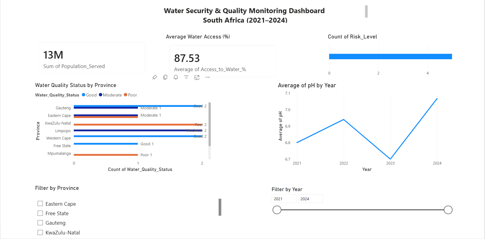
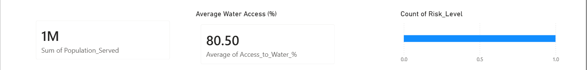
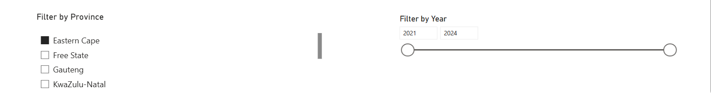

# Water Security & Quality Monitoring Dashboard (South Africa)

## 📊 Project Overview

This project presents an interactive Power BI dashboard analyzing water quality and water security indicators across selected South African municipalities (2021–2024).

The objective was to simulate a policy-oriented monitoring tool that supports environmental decision-making, water risk assessment, and development planning.

The dashboard was developed using **Power BI Service (Web version)** due to restricted installation permissions, demonstrating adaptability in constrained IT environments.

---

## 🎯 Key Objectives

- Assess water quality indicators (pH, turbidity, nitrates, E. coli)
- Identify high-risk municipalities
- Monitor trends in water quality over time
- Support data-driven environmental policy insights

---

## 🛠 Tools Used

- Power BI Service (Web)
- Microsoft Excel
- Data modeling & aggregation techniques
- Interactive filtering (slicers)

---

## 📈 Dashboard Features

- KPI Cards:
  - Total Population Served
  - Average Water Access (%)
  - High-Risk Municipalities

- Clustered Bar Chart:
  - Water Quality Status by Province

- Line Chart:
  - Average pH Trend Over Time

- Interactive Filters:
  - Province
  - Year

---

## 🖼 Dashboard Preview

### Full Dashboard Overview

### KPI Section

### Charts Section

---

## 📂 Dataset

The dataset includes simulated water security indicators:
- Province & Municipality
- Water source type
- pH, Turbidity, Nitrate levels
- E. coli counts
- Water access percentages
- Risk classification

The dataset file is included in this repository.

---

## 🌍 Relevance to Development & Water Policy

This dashboard simulates a monitoring tool that could support:
- Water resource planning
- Risk prioritization
- Environmental compliance tracking
- Climate resilience strategy

The project aligns with interests in water security, environmental systems analysis, and global development policy.

